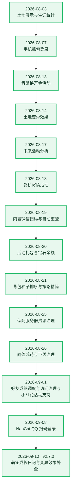

# 🌱 农场成长记录

[← 返回项目首页](../README.md)

这里记录 QQ Farm Bot 已完成的重要功能和改进。最新记录在最前面。

## 更新流水图

## 详细记录

### 2026-09-10 · v2.7.0 · 萌宠成长日记与变异效果补全

- 活动中心新增“萌宠成长日记”，支持比熊养成、爪印手记、拾物小铺、节令赠礼与宝藏护送，展示成长进度、每日次数、活动库存和奖励状态，并接入官方场景与物品素材。
- “设置 → 账号设置 → 日常与活动”新增萌宠活动自动化配置，支持领养与领取比熊、自动投喂、自动寻宝、领取手记奖励和种子礼包、领取节令赠礼、开启护送宝藏、领取夺宝补偿及选择锦囊；资源不足时跳过，锦囊刷新仅使用免费额度。
- 萌宠活动入口和自动化开关按活动有效期管理，配置加载与任务执行时拦截过期活动，避免历史开关重新启动已结束任务。
- 优化萌宠活动页面分区、宝藏护送展示与白露节令场景，补充活动作物、种子、果实和图鉴物品配置及图片，完善作物生长阶段素材与泡泡棉花糖的 2×2 占地配置。
- 补充晶辉、比熊和乐园变异的名称与图标，土地卡片新增晶辉动画效果。
- 修复商城头像框购买状态识别，结合商城限购记录判断是否已购买，避免重复显示可购买状态。

### 2026-09-08 · NapCat QQ 扫码登录与 Docker 部署

- 将 QQ MiniApp OpenAuth 能力直接集成到项目中，新增受管理后台鉴权保护的 NapCat 登录任务接口，可完成 QQ 扫码、确认登录、获取农场 Code、添加账号和退出临时 QQ 会话的完整流程。
- “添加账号”新增按能力动态显示的“QQ 扫码”标签；进入标签后自动获取二维码，移除额外刷新按钮，支持点击二维码刷新，并在二维码过期前自动换新。
- 修正扫码任务状态判断：只有 NapCat 明确返回已登录并提供真实 QQ 号后才开始获取农场 Code，避免尚未扫码时提前显示清理会话或误用已过期二维码。
- 修复项目或容器重启后 NapCat 恢复旧 QQ 会话、再次扫码返回 `QQ Is Logined` 的问题；生成新二维码前会清空快速登录账号，并把离线残留会话一并视为待清理状态。
- 修复已停止账号通过 QQ 扫码更新 Code 后只保存但不启动的问题；扫码保存现在会明确调度账号启动，原本运行中的账号则使用新 Code 重启。
- 同一管理员重复打开扫码界面时复用当前任务，取消操作保持幂等；轮询类错误改为面板内提示，避免右上角连续弹出通用“请求失败”通知。
- OpenAuth 调用会等待插件上下文就绪，降低扫码刚完成时出现 `OneBot context not available` 的概率；成功取得 Code 后立即返回并在后台清理临时会话，缩短账号添加等待时间，同时在清理完成前阻止下一个扫码任务进入不安全状态。
- 从 NapCat 当前账号上下文读取 QQ 号和昵称，扫码添加账号时优先使用真实昵称，并保留 QQ 号作为缺少昵称时的回退名称。
- 新增可选 `napcat` Compose profile，默认保持关闭以适配低配置机器；启用后仅运行农场服务和基于 NapCat 官方镜像构建的派生服务，构建阶段自动安装内置 OpenAuth 插件，无需重复执行一次性安装脚本。
- NapCat WebUI/OpenAuth 内部 Token 在首次启动时随机生成并通过只读共享文件交给农场服务，不要求用户把 Token 写入环境变量；NapCat 配置、QQ 数据和 Token 均持久化到宿主机数据目录。
- 默认采用同时支持 `linux/amd64` 和 `linux/arm64` 的官方镜像版本，覆盖常见 x64/ARM Linux、Intel Mac 和 Apple Silicon Mac，并保留多个可选固定版本及 `latest`。
- 新增 `compose.sh` 启动入口，在 macOS 和 Linux 上自动读取宿主机名称并设置为 QQ 登录设备名称；仍可通过 `NAPCAT_DEVICE_NAME` 显式覆盖。
- 新增 NapCat 登录任务、所有权隔离、登录状态识别、昵称同步、OpenAuth 就绪等待、刷新、重启残留会话与退出清理测试；后端完整测试集 273 项全部通过，并通过前端类型检查、生产构建、Compose 配置校验、派生镜像构建和容器启动冒烟检查。

### 2026-09-01 · 公益小红花活动支持
- 活动奖励基本没有，图一乐。

### 2026-09-01 · 好友成熟调度与访问治理

- 根据好友摘要和土地生长阶段维护内存成熟计划，将固定 25～30 秒偷取轮询改为成熟时间驱动唤醒；好友摘要以 15 分钟低频校准，进程重启后渐进重建计划。
- 每轮最多处理 12 个到期或明确可偷好友，并最多分批进入 3 个未知或过期好友农场补全土地状态，降低好友、地块较多时的瞬时请求量和计算压力。
- 接入好友土地通知、进入农场结果和收获回包，及时修正下一成熟时间；局部通知不会覆盖已缓存的完整土地成熟计划。
- 保留 `Visit.Enter → PlantService.CheckCanOperate → PlantService.Harvest → Visit.Leave` 偷取协议及操作次数更新，并为整个好友访问区间增加串行会话锁，避免自动偷取、帮助任务和手动访问互相覆盖当前农场状态。
- 好友帮助巡查的后续间隔不低于 10 分钟，取消启动时一次性读取全部好友看门狗状态，相关缓存改为随访问逐步填充。
- 批量好友操作仅在服务端明确返回“不支持批量”时执行有界降级；未知错误不再盲目逐地块重试，并确保异常路径退出好友农场。
- 统一登录、WebSocket 和 TSDK 使用的设备环境标识，对矛盾或不完整的自定义设备配置进行校验，减少同一会话内的平台和设备信息冲突。
- 将任务、邮件、施肥等工作从农场高频循环中拆分，改由独立事件或日常调度执行，避免不同任务在同一时间集中触发。
- 新增成熟计划、访问串行化、批量降级、好友节奏和设备协议测试；后端完整测试集共 255 项全部通过。
- 本次调整用于减少无效请求、批量失败放大和明显机器化节奏，不构成规避官方风控或账号安全保证；真实账号下的秒偷及时性和好友手动操作同步仍需实际运行观察，如有问题请及时反馈。

### 2026-08-26 · 雨落成诗活动适配

- 活动中心接入“雨落成诗”，支持查看天气采集瓶、雷雨召唤瓶、雷电徽章、当前天气、采集次数、气象任务和气象研究节点。
- 后端新增天气协议解析，接入活动查询、每日购买天气采集瓶、自动寻找雷雨好友采集、使用雷雨召唤瓶和解锁气象研究节点。
- “设置 → 账号设置 → 日常与活动”新增雨落成诗二级卡片，可按账号开启自动购买天气采集瓶、自动采集好友雷雨、自动使用雷雨召唤瓶和自动解锁气象研究。
- 使坏瓶适配支持，当前并未测试效果。
- 雨落成诗自动开关跟随活动有效期管理，活动未开始或结束后自动关闭，前端二级卡片与活动入口同步置灰或隐藏。
- 新增雨落成诗协议解析、活动边界、召唤瓶请求、闪电变异识别和奖励映射测试。
- 个人地块界面新增闪电雷雨天气、作物闪电特效支持。

### 2026-08-26 · 限时活动下线与开关防回启

- 活动页隐藏即将到期的“心许千灯星垂野”相关内容，停止请求对应活动数据；无进行中活动时展示统一空态，管理员仍可进入活动分析。
- “设置 → 日常与活动”隐藏心许千灯相关活动卡片，并同步处理旧版自动控制页面中的活动开关。
- 心许千灯、青酿换万金和鹊桥寄情等已隐藏活动的自动化开关统一默认为关闭。
- 配置加载、配置提交和后台任务调度前统一强制关闭已隐藏活动开关，避免旧账号的历史开启状态导致过期任务继续运行或再次启动。
- 新增隐藏活动开关防回启测试；后端完整测试集共 191 项全部通过，并通过前端类型检查和生产构建。

### 2026-08-25 · 低配服务器资源治理与线程调度优化

- 新增自动资源档位识别，根据 CPU 核数和物理内存选择调度策略；2 核或不超过 2.5GB 内存的服务器会自动采用保守配置，无需手动开启低配模式。
- 账号 Worker 改为分批、错峰启动，低配环境默认逐个初始化并增加启动间隔，降低多账号同时加载模块和 TSDK/WASM 时的 CPU、磁盘与内存峰值。
- 新增主线程全局任务令牌治理：低配环境下跨账号农场、帮助和偷菜巡查默认单并发执行，Worker 退出或重启时自动清理排队及占用令牌。
- 为不同账号的巡查时间加入稳定偏移，减少多个账号在相同时刻集中发起网络请求；未登录状态的调度轮询由固定 500ms 改为指数退避。
- 状态同步改为业务状态变化时推送并辅以低频全量保底，忽略纯倒计时变化，降低 Worker 与主线程之间的 IPC、序列化和面板广播开销。
- 统一管理后台会话清理、安全限流清理和化肥购买检查等长期定时任务；调度器新增完整销毁能力，可同时清除任务和注册命名空间。
- 调度器状态接口新增主进程和账号 Worker 的 RSS、Heap、External/ArrayBuffer、事件循环平均/最大/P99 延迟，以及全局任务执行和排队数量，便于评估实际账号容量。
- 低配环境在进程 RSS 接近物理内存 80% 时暂停启动新账号，避免继续扩容导致系统 OOM；不设置固定账号数量上限，也不会自动停止已经运行的账号。
- 补充调度器生命周期测试；完整测试集共 186 项全部通过。

### 2026-08-21 · 背包种子排序与选种策略精简

- “背包种子优先”改为后端自动维护顺序，不再提供恢复默认、拖拽、上下移动或删除等手动调整操作。
- 种子按官方客户端规则排列：稀有种子优先，其次按作物经验降序，同经验按种子 ID 升序；页面展示与实际种植共用同一规则。
- 种子顺序从策略设置移至“个人 → 我的背包 → 种子”，包含 2×2 种子；单格种植流程仍会排除 2×2 种子。
- 修正种子等级来源，优先读取种子物品配置；活动或稀有种子统一显示“稀有”，不再显示无意义的“1级”。
- 修正活动植物增量配置覆盖当前官方植物名称的问题，避免复用种子 ID 显示为历史活动作物。
- 删除“优先种植种子”策略及相关配置、执行分支和界面选项；旧主策略自动回退到“最大经验/时”，旧第二优先策略自动回退到“最高等级作物”。
- 修复 2×2 种植路径调用未定义 `getBagSeedPriority` 导致的运行错误，并补充官方背包顺序和旧策略迁移测试。

### 2026-08-20 · 活动礼包与钻石余额

- 道具商城新增鹊桥寄情礼包、千星每日礼包和两档千星礼包，支持展示折扣、每日/活动限购数量及已购进度。
- 按官方商品数据区分购买货币：`1027`、`1028` 使用钻石，`1029` 使用点券；商品卡、余额判断和购买确认文案保持一致。
- 活动商品按服务端结束时间过滤，页面停留期间到期也会自动隐藏，无需手动刷新。
- 道具商城支持自动发现后续活动商品：官方响应中带活动标记或截止时间的新商品无需预置 ID 即可展示，普通常规商品仍按既有范围过滤。
- 修正新版道具商城协议的商品列表、价格货币、折扣、限购和活动截止时间字段，兼容已售罄商品的响应形式。
- 新增钻石余额读取与实时状态同步；商城顶部和概况资源卡现可展示钻石余额。
- 手动填码支持直接粘贴官方 WebSocket 完整 URL：自动提取 `code`、`platform` 和 `ver`，并在保存账号时校准系统客户端版本。
- 补充商城价格货币与限购协议测试，并通过前端类型检查和生产构建。

### 2026-08-19 · 内置微信扫码、版本同步与运行自愈

- 移植进程内应用宝登录协议：通过微信 OAuth 扫码取得会话，再由内置 MMTLS 协议换取农场微信小游戏 Code，不再要求额外部署 YYB-GO 或第三方登录服务。
- “添加账号”开放微信扫码标签；进入标签后自动获取二维码，二维码空态和按钮均可手动获取或刷新。
- 修复扫码请求未携带面板登录 Token、后端无法识别当前用户的问题；扫码会话按当前用户隔离，避免多用户之间串用凭证。
- 微信扫码账号持久化 `loginBuffer`、`refreshtoken` 和 `accesstoken`，账号列表接口不向浏览器返回这些敏感字段。
- 扫码添加成功后默认启动账号，并自动开启“自动刷新获取 Code”，默认间隔为 60 分钟；已有内置凭证的旧微信账号会执行一次默认配置迁移。
- 每 30 分钟主动滚动保活应用宝凭证；手动启动、程序启动和定时刷新会优先通过内置协议获取新 Code，成功后更新账号并重启 Worker。
- 账号被踢或 WebSocket 多次重连失败后，可按自动刷新间隔延迟重登，并保留防止旧 Code 循环重连的停止行为。
- 保留外部微信登录 API 作为旧账号兼容回退；具备 `loginBuffer` 的新扫码账号不会回落到外部 API。默认不要求代理池，若网络环境确需代理，应使用账号固定出口而非随机轮换。
- 接入 WebSocket 服务端版本自动校准：登录回包和心跳回包会检查 `version_force`、`version_recommend`，优先采用强制版本并将完整客户端版本持久化到系统配置。
- Worker 检测到版本变化后上报主进程，主进程同步更新运行时和配置文件，后续 WebSocket URL、登录请求及心跳请求使用新版本。
- 已完成微信二维码在线生成验证、前端类型检查与生产构建；完整凭证生命周期仍需持续运行观察，凭证被撤销或过期时需重新扫码。
- 微信账号 WebSocket 登录返回 400 时接入内置应用宝刷新链路，刷新凭据和农场 Code 后自动重启账号；同账号同时触发的刷新会合并，避免滚动 Token 并发覆盖。
- 增加 Worker 看门狗：每 30 秒探测、90 秒无响应自动重启；一小时内最多自动重启 3 次，超限后停止账号。
- 增加自动恢复熔断：单账号每日最多 8 次恢复，连续刷新失败 3 次后停止自动尝试，成功恢复会清零连续失败计数。
- 账号接口不再接受客户端直接提交 `loginBuffer`、Refresh Token 或 Access Token；更换 `wxid` 时自动清空旧凭据，只有与当前面板用户绑定的有效扫码会话可以写入新凭据。
- 本次未包含业务请求合并、心跳请求容量预留和资源包完整性校验；这些运行质量优化仍属于后续范围。

### 2026-08-18 · 鹊桥寄情活动

- 支持自动使用、自动构建和自动指定好友赠送。
- 当前功能尚未完成全面测试。

### 2026-08-17 · 未来活动分析

- 活动页新增未来活动分析功能。
- 活动正式接入仍需要采集对应数据。

### 2026-08-14 · 土地变异效果

- “个人 → 我的农场 → 土地详情”新增作物变异效果展示，支持黄金、冰冻、爱心、暗化和湿润效果。
- 根据官方 `mutant_effect_plant` 配置映射变异作物，黄金变异可展示对应的金色植物贴图，并兼容多种变异组合。
- 暗化效果使用官方烟雾和粒子素材；其余效果结合对应作物显示金色辉光、冰晶、爱心和下落水滴动画。
- 所有变异动画限制在当前作物区域内，并调整作物锚点，使作物及特效更贴近菱形土地的视觉中心。
- 土地详情展示变异效果的实际作用，例如售价倍数、产量倍数或黄金果实产出。

### 2026-08-13 · 青酿换万金活动

- 新增活动页面。
- “自动控制 → 活动控制”中新增自动开关。

### 2026-08-07 · 手机抓包登录

- 内置纯 Node.js 抓包服务，默认嵌入 Bot 进程，无需单独启动服务或端口。
- 手机设置 Wi-Fi 代理后打开 QQ 农场，即可自动获取登录 Code 并添加账号。
- 支持多 IP 公布、局域网和 Tailscale 组网，面板可根据网络环境选择地址。
- 获取 Code 的同时解析好友 GID，并在后台同步 QQ 平台好友列表。
- 详细步骤见[抓包登录服务手册](../core/docs/capture-service.md)。

### 2026-08-03 · 土地展示重做

- 参考游戏内农场布局，实现等距视角土地展示。
- 完善普通作物各生长阶段图片。
- 完善四格作物展示，并使用官方资源生成对应图片。
- 新增土地资源图片更新指令。

### 2026-08-03 · 生涯统计与体验优化

- 点击头像即可查看生涯统计。
- 新增神秘商人自动购买开关。
- 修复每日任务进度展示错误。
- 修复种子获取策略问题。

### 2026-08-03 · 心许千灯星垂野活动

- 新增活动页面，可查看活动进度、星砂余额和奖励状态。
- 支持“观星礼录”奖励领取与“星砂兑换商店”奖励批量兑换。
- 支持领取“千星游记”阶段奖励和“节令小札”节令奖励。
- 新增“千星游记”和“观星礼录”自动领取选项，每 5 分钟检查一次。
- 补充活动作物、种子、装扮等奖励配置及活动专属图片资源。

### 2026-08-03 · TSDK/WASM 协议更新

- TSDK/WASM 升级至官方 `v3.8.6.1785240280`，适配新版运行时、数据段解密和完整性校验。
- 更新默认 WASM 文件及 SHA-256 校验，确保网关 Token、ACE 心跳和多账号运行正常。
- 新增 TSDK/WASM 更新检查工具，可比较版本、导入导出、数据段和关键运行参数。
- 补充标准更新、验证与回退流程。

### 2026-08-03 · 2×2 作物种植

- 修复活动四格作物“星语铃花”的占地配置，背包中增加 2×2 标识。
- 优化四格作物土地预留策略，优先选择已清空土地更多的区域。
- 收获后土地状态不明确时不再自动铲除，避免误铲仍在生长或进入下一季的四格作物。
- 补充土地展示、活动作物配置和 2×2 种植预留测试。
